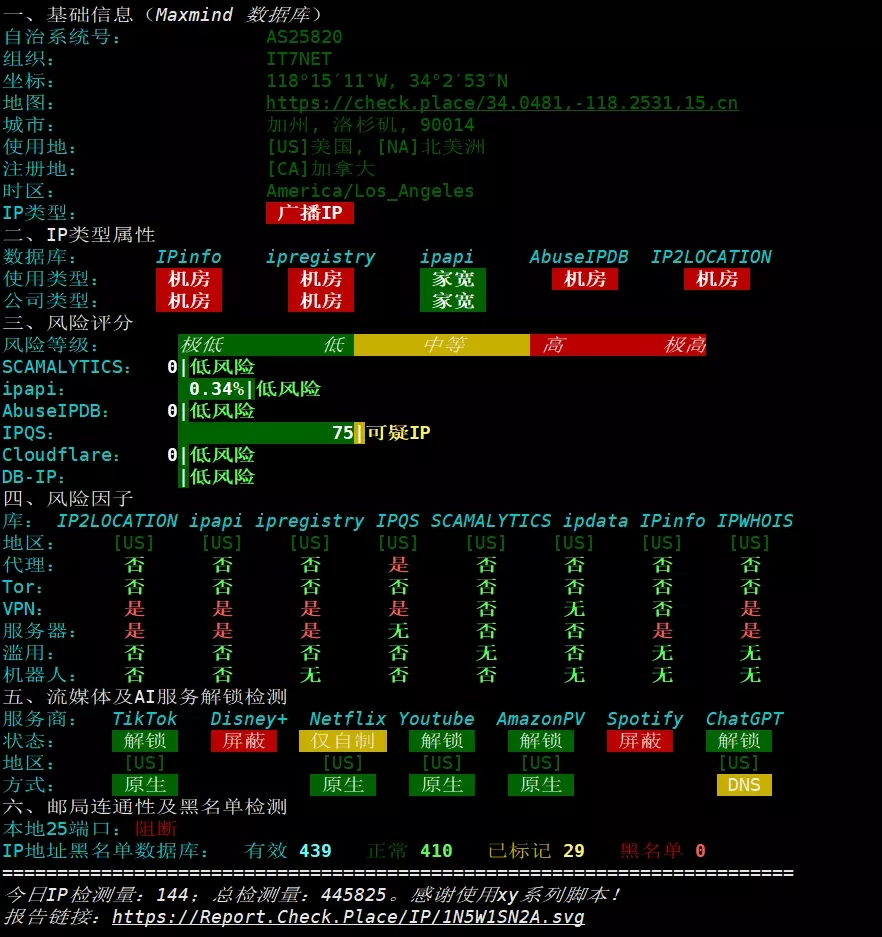

# 搬瓦工MEGABOX-PRO实测：AMD EPYC Genoa加持的CN2 GIA线路表现如何？

---

最近拿到一台搬瓦工MEGABOX-PRO的测试机，配置是AMD EPYC-Genoa处理器+2GB内存+40GB SSD，洛杉矶机房。看到这个配置，我第一反应是：这处理器有点意思啊，Genoa架构在VPS上还不算常见。

测试跑完才发现，这台机器在线路质量上确实有两把刷子——电信、联通、移动三网都走CN2 GIA/CMIN2精品线路。对于需要稳定连接国内的用户来说，这个表现算是意料之中的惊喜。

---

## 基础配置一览

先看硬件：
- **CPU**：AMD EPYC-Genoa，2核心，主频2.79GHz
- **内存**：2GB（实际可用约2GB）
- **硬盘**：40GB SSD
- **虚拟化**：KVM架构
- **系统**：Debian 12（开箱即用）

这配置属于入门级别，适合跑个人博客、轻量级代理或者开发测试环境。硬盘读写测试显示：4K随机读写都在147MB/s左右，1M块读写能到2GB/s。对于普通场景来说，这个IO性能够用了。

---

## CPU和内存表现

跑了一轮sysbench，单核得分1645，双核3297。这个分数在VPS里属于中规中矩——毕竟是共享资源，不能和独立服务器比。

内存测试倒是有点意外：单线程读速度44.5GB/s，写速度19.9GB/s。这个数据在同价位VPS里算是不错的表现，说明内存带宽没有被严重限制。

**说人话就是**：日常跑个Nginx、MySQL或者小型Node.js应用，完全不会卡顿。如果你想跑大型数据库或者视频转码，那还是换更高配置的方案吧。

---

## 网络线路：三网回程全程精品

这才是重点。测试结果显示：
- **电信**：全程CN2 GIA
- **联通**：去程CN2 GIA，回程4837（普通线路）
- **移动**：全程CMIN2

什么意思？简单说就是：电信用户体验最好，联通用户凑合，移动用户也还行。CN2 GIA是电信的高端线路，绕路少、延迟低、丢包率基本为零。从洛杉矶到广州的测试里，电信回程延迟在150ms左右，移动在160ms，联通在195ms。

👉 **如果你主要用电信宽带，想要稳定低延的海外VPS**，[搬瓦工的CN2 GIA线路确实值得考虑](https://bandwagonhost.com/aff.php?aff=79616)——至少在晚高峰时段不会突然炸线。

Speedtest测速显示：
- 上传速度最高能到8.5Gbps（对，你没看错，是Gbps）
- 下载速度约4.2Gbps
- 到国内节点的实际速度：上传600-2500Mbps，下载600-2600Mbps

这个带宽跑满基本不现实，但意味着你不用担心突发流量把带宽打满。

---

## 流媒体解锁情况

测了一圈常见平台：
- **Netflix**：能看自制剧（原创内容），但不是全库
- **YouTube Premium**：正常解锁
- **Disney+**：IP被封（这个比较常见）
- **TikTok**：识别为美国区

如果你就是想挂代理看个YouTube或者ChatGPT，这台机器没问题。但如果指望用它看Netflix全库或者Disney+，那可能要失望了。

---

## IP质量和邮件端口

IP质量检测显示：
- 被标记为数据中心IP（废话，本来就是VPS）
- 部分数据库标记为代理/VPN
- Google搜索不可用（可能被限制）
- 邮件端口大部分正常，Gmail和Yahoo的部分端口受限

**翻译一下**：这个IP适合跑代理、网站、开发环境，但不适合做外贸邮件服务器或者需要"干净IP"的业务。

---

## 适合什么场景？

根据测试结果，这台机器比较适合：
1. **个人轻量级代理**：电信用户体验最佳，晚高峰也能保持稳定
2. **小型网站或博客**：IO和带宽都够用，延迟可以接受
3. **开发测试环境**：KVM架构+Debian系统，配置灵活
4. **轻度流媒体**：YouTube没问题，Netflix只能看原创

**不适合**：
- 需要大量计算资源的任务（单核性能一般）
- 对IP纯净度要求高的业务（邮件群发之类的）
- 需要全库Netflix或Disney+解锁的场景

---

总的来说，搬瓦工MEGABOX-PRO这台机器的核心卖点是**线路质量**而不是硬件配置。如果你是电信用户，需要一台稳定的海外VPS跑代理或者小型应用，👉 [这个方案确实比普通的直连线路靠谱得多](https://bandwagonhost.com/aff.php?aff=79616)。但如果你对CPU性能或者IP纯净度有更高要求，可能需要看看其他配置或者商家。

测试数据放这了，需要的自己对比参考。记住一句话：**没有完美的VPS,只有适合自己需求的选择**。
